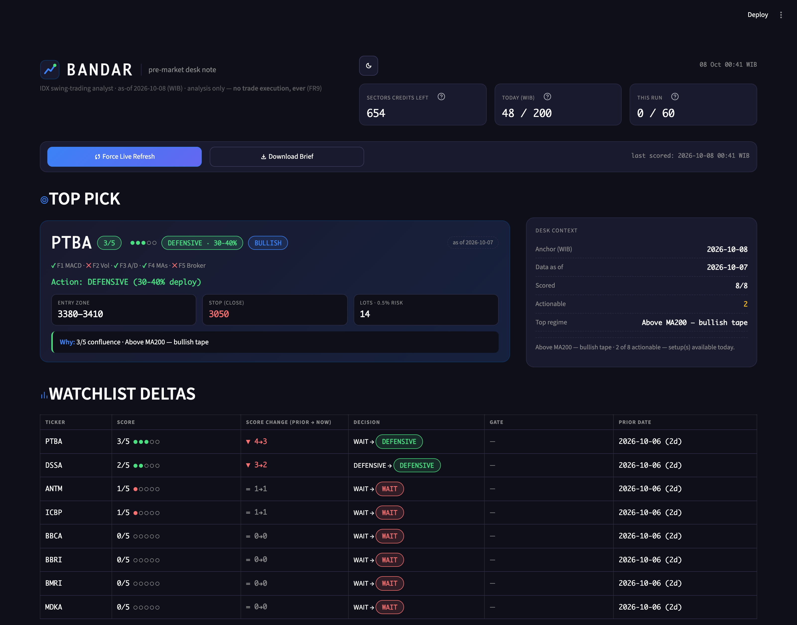
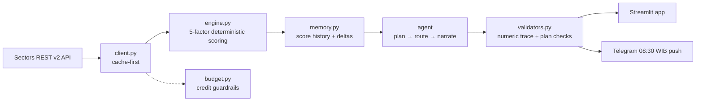

<div align="center">

# 📈 BANDAR

**An autonomous pre-market AI analyst for IDX swing traders.**

A deterministic 5-factor confluence engine does the math. A genuine LLM agent plans, routes,
remembers, and narrates — **but never computes a number.** Every morning you get a disciplined,
act-on-able brief: entry, close-based stop, 0.5%-risk position size, and what changed since yesterday.


<!-- HERO IMAGE: replace the line below with a screenshot/GIF of the running app.
     Generate one credit-free with:  BANDAR_AS_OF=2026-10-06 python dev_screenshot.py
     Then:    -->
<!--  -->

</div>

---

## The Problem

Retail swing traders on the Indonesia Stock Exchange lose to their own habits:

- 😵 **Drowning in noise** — dozens of tickers, no consistent way to rank them before the open.
- 🟢 **Chasing green candles** — buying stocks that are already extended or limit-up (ARA), the classic retail trap.
- 🎲 **Emotional sizing** — no fixed risk rule, so one bad trade wrecks the account.
- 🔁 **No repeatable routine** — re-doing the same manual analysis every single morning.

Existing tools are either **dumb screeners** (no reasoning, no memory) or **black-box AI**
(numbers you can't trust). There is no disciplined middle ground.

## The Solution

**Bandar** is that middle ground: trustworthy deterministic math, wrapped in a genuine agent that
explains it in plain language.

Every pre-market session it delivers a **disciplined brief** for your watchlist:

- **TOP PICK** — score `x/5`, the 5 factor ticks, a decision label, entry zone, close-based stop, and lot size.
- **WATCHLIST DELTAS** — what changed since the last run (`old → new` + prior date).
- **A free 08:30 WIB Telegram push** — the same brief, straight to your phone.
- **Free-text ask** — "who's accumulating BMRI?", "top pick today?" — routed by the agent.

> **One-sentence problem statement:** *Bandar is an autonomous pre-market AI analyst for IDX swing
> traders that replaces emotional, ad-hoc stock picking with a disciplined daily brief — scoring a
> watchlist through a deterministic 5-factor confluence engine and delivering an act-on-able plan
> (entry, close-based stop, and 0.5%-risk position size) via a Streamlit app and a free 08:30 WIB Telegram push.*

## Architecture

The core design rule: **the LLM never computes a number.** All math lives in a deterministic engine;
the agent only plans, routes, remembers, and narrates.



**What makes the agent genuine (not decoration):**

- 🧮 **Deterministic engine, honest LLM.** The 5-factor math is pure code. The agent cannot invent a number.
- 🔢 **Numeric trace validator.** Every figure in the output must appear in a tool-result trace — anything unverifiable is dropped or flagged `[removed]`. This is the anti-hallucination guarantee.
- 🚦 **No-chase gate.** Even a perfect `4/4` score is **forced to WAIT-pullback** if the stock is over-extended (`> 0.5 × ATR14`) or hit its limit-up (ARA). Discipline beats a hot signal.
- 🧠 **Plan → route → remember.** The agent picks tools by sub-question (price/TA → engine, valuation → fundamentals, smart-money → broker/flow, universe → screener), reads history before scoring, and reports deltas.
- ⚠️ **Kill test.** Remove the agent layer and only a screener remains — it can no longer plan, remember, or answer free-text. That's the proof the agent is real.

## The 5-Factor Confluence Engine

Each factor scores `1` (pass) or `0`. The engine aggregates honestly.

| # | Factor | Passes when | Signal it captures |
|---|--------|-------------|--------------------|
| **F1** | MACD | MACD > Signal, histogram ≥ 0 and rising | Momentum |
| **F2** | Volume | Volume ≥ 1.5× its 20-day average | Participation / conviction |
| **F3** | Accumulation/Distribution | A/D slope over last 10 bars > 0 | Money flow |
| **F4** | MA Stack | Price > EMA9 > EMA26 > SMA50 > SMA200 (≥3 aligned) | Trend regime |
| **F5** | Broker / Foreign Flow | Net foreign buy > 0, broker concentration ≥ threshold, avg buy ≤ close | Smart money |

**Honest-null rule:** if broker/foreign data is missing, the denominator **drops to 4** and `F5` is
reported `null` — **never fabricated.** Fewer than 60 bars → `insufficient_data`.

**Decisions** map score → sizing: `AGGRESSIVE` · `DEFENSIVE` · `SCALP` · `WAIT/CASH`, each with a %
of equity to deploy. Position size uses a fixed **0.5%-risk** rule with a **close-based stop only**
and whole IDX lots at valid tick sizes.

## Product Surfaces

- **Answer foreground, workings collapsed.** The trader sees the decision first; the agent plan, data
  pulls (cache/live tags), and per-factor math live in a collapsed expander.
- **Credit meter** (`st.metric`) — always visible, because every live call costs credits.
- **Streaming brief** (`st.write_stream`) — narrated like a desk note.
- **Theme toggle** — dark "terminal" default (camera-safe) + light alternate.
- **Explicit-action API calls** — nothing hits the network unless you press a button or submit an ask.

## What Bandar Can (and Can't) Answer

The free-text assistant routes every question into one of **five intents** — and politely refuses
everything else.

| Intent | What it answers | Example |
|---|---|---|
| **daily_brief** | Rankings, top pick, watchlist overview, what changed | "top pick today?" |
| **score_ticker** | Price/TA/confluence/decision for a watchlist symbol | "is BBRI a buy?" |
| **smart_money** | Broker activity, foreign flow, accumulation/distribution | "who's accumulating DSSA?" |
| **valuation** | Fundamentals / financials / valuation of a symbol | "is BBCA cheap?" |
| **screen** | The wider IDX universe beyond the watchlist | "which stocks have heavy foreign buy?" |

**Caveats:** data is **daily end-of-day (as-of dated)** — pre-market, not live intraday ticks.
Bandar only quotes figures present in tool results (trace-validated) and scores are
watchlist-scoped.

**Won't do:** trade execution or order placement (never, FR9) · price predictions or guarantees ·
personal-finance/portfolio/tax advice · non-IDX instruments · news/sentiment/order-book depth ·
chit-chat.

**On failure:** if the LLM is unavailable (quota/overload), Bandar falls back to a **deterministic
engine-built brief** or an honest outage message — it never fabricates an answer.

## Quickstart

```bash
# 1. Clone and install
git clone <your-repo-url> bandar
cd bandar
python -m venv .venv && source .venv/bin/activate
pip install -r requirements.txt

# 2. Configure secrets (never committed)
cp .env.example .env      # then fill in your keys

# 3. Run the app
streamlit run app.py
```

### ▶️ Demo without spending a single credit

Bandar can replay a previously seeded day from cache — perfect for demos and recordings:

```bash
BANDAR_AS_OF=2026-10-06 streamlit run app.py     # deterministic, 0 credits, camera-safe
```

Without an API key the client runs in **offline** mode (a cache miss raises instead of spending).

### Environment variables

| Variable | Purpose | Required for |
|---|---|---|
| `SECTORS_API_KEY` | Sectors REST v2 key (data source) | live scoring |
| `BANDAR_WATCHLIST` | 6–12 IDX symbols, comma-separated | scoring |
| `EQUITY_IDR` | Account equity for position sizing (default `100000000`) | sizing |
| `GEMINI_API_KEY` | Primary runtime LLM (Gemini Flash) | agent |
| `ANTHROPIC_API_KEY` | Hot-swap fallback LLM (Claude Sonnet) | optional |
| `TELEGRAM_BOT_TOKEN`, `TELEGRAM_CHAT_ID` | Morning push delivery | Telegram |
| `BANDAR_AS_OF` | Replay a seeded date deterministically (0 cr) | demos/tests |
| `BANDAR_THEME` | `dark` (default) \| `light` | UI |

## Tests

Milestone-gated suite covering the data layer, engine, memory, agent tools/planner, executor/validators,
UI, and Telegram push:

```bash
pytest test_m1.py test_m2.py test_m3.py test_m4a.py test_m4b.py test_m5.py test_m6.py
```

Notable guarantees under test: **no-chase gate** (`4/4` + extended ⇒ `WAIT`), **cache hit spends 0 cr**,
**offline miss raises**, **denominator-4 fallback** with no fabricated flow, and **numeric trace validation**.

## Credit Budget & Safety

Sectors credits are a scarce grant (1,000 cr), so Bandar treats every call as billable:

- **60-credit hard cap per run** → aborts if breached.
- **200-credit untouchable reserve.**
- **Cache-first** — a cache hit never touches the network or the guard.
- **Only 2xx and 404 bill.** `400/401/403/429/5xx` are **free.**
- Every live call is logged; the ledger persists across runs.

**Non-negotiables:** no trade execution ever · close-based stops only · every output number traces to a
tool result · the product must break without Sectors.

## Tech Stack

| Layer | Tech |
|---|---|
| **Language** | Python 3.11+ |
| **UI** | Streamlit (`st.write_stream`, `st.metric`, `st.status`, `st.session_state`) |
| **Data source** | Sectors REST v2 (`https://api.sectors.app`) via plain `requests` |
| **Storage** | SQLite (score history) + JSON (cache, watchlist, credit ledger) |
| **Indicators** | pandas + pandas-ta (MACD, A/D, EMAs/SMAs, ATR, volume) |
| **Agent** | Raw tool-calling loop — **no agent framework** |
| **Runtime LLM** | Gemini Flash (primary) · Claude Sonnet (config-only hot-swap fallback) · max 3 calls/run |
| **Delivery** | Telegram Bot API (`requests.post`) |
| **Automation** | GitHub Actions (morning push runner) |
| **Config / secrets** | python-dotenv (`.env`, gitignored) |
| **Tests** | pytest (milestone-gated M1–M6) |

## Project Structure

| Path | Role |
|---|---|
| `app.py` | Streamlit UI — answer foreground, workings collapsed |
| `engine.py` | Deterministic 5-factor scoring + no-chase gate + sizing |
| `client.py` | Sectors REST v2 client — cache-first / live / offline modes |
| `budget.py` | Credit guardrails (precheck, charge, caps, ledger) |
| `memory.py` | SQLite score history + delta queries + watchlist |
| `agent/` | LLM agent — `planner`, `executor`, `tools` (7), `validators`, `config`, `llm` |
| `telegram_push.py` | 08:30 WIB morning brief |
| `seed_snapshot.py` | One-time watchlist seeding (~30 cr) for offline demos |
| `.github/workflows/bandar-push.yml` | GitHub Actions runner for the Telegram push |
| `test_m1.py … test_m6.py` | Milestone test suite |

**The 7 agent tools:** `score_ticker` · `rank_watchlist` · `score_history` · `get_fundamentals` ·
`get_foreign_flow` · `screen` · `watchlist_rw`.

## Built for the Sectors Hackathon 2026

- **Track 1 — AI Agents & Assistants**
- **Team:** Haris Salman Al-Ghifary (solo)
- **Core data source:** Sectors REST v2
- **Runtime LLM:** Gemini Flash (primary) · Claude Sonnet (config-only hot-swap fallback) · max 3 LLM calls per run

## Disclaimer

> ⚠️ **Educational project — not financial advice.** Bandar is a decision-support tool built for a
> hackathon. It has **no trade-execution path** and never places, modifies, or cancels orders. Markets
> are risky; do your own research and consult a licensed advisor before trading.
